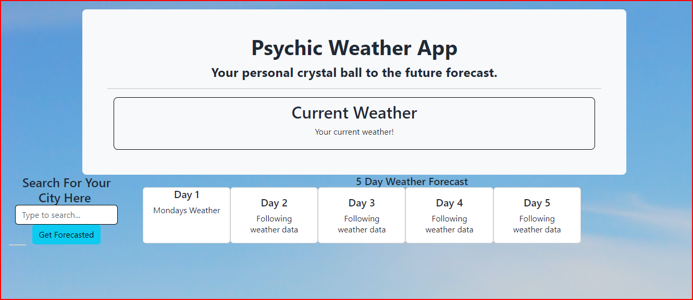

# Psychic-Weather-App
<tr>
<td>Psychic Weather App</td>
</tr>
<table>
<tr>
<td>I created this app to furthur my knowledge of working with API's and gain more experience in javascript and jquery. Although, not complete I learned a lot about making fetch calls and accessing data in objects.</td>
</tr>
<tr>
<td></td>
</tr>
</table>

## Project URL
- [https://github.com/kaleikautakaoka/Psychic-Weather-App](https://github.com/kaleikautakaoka/Psychic-Weather-App)
## Deployment
- [https://kaleikautakaoka.github.io/Psychic-Weather-App/](https://kaleikautakaoka.github.io/Psychic-Weather-App/)
## Demo/Screenshot

## Technologies

HTML, CSS, Javascript, Bootstrap, jquery

## License

NA

## Resources

[w3schools](https://www.w3schools.com/)
[FlexboxFroggy](https://flexboxfroggy.com/)
[CSS-Tracks](https://css-tricks.com/)
[Youtube](https://www.youtube.com/watch?v=1Rs2ND1ryYc)
[Unsplash](https://unsplash.com/s/photos/hero-header)
[pixabay](https://pixabay.com/illustrations
cloud-computer-circuit-board-cpu-6532831/)
[Devon Abbott](http://dabbott.github.io/javascript-playgrounds/)

## Contact

Email: sasasa@gmail.com

## Author

Author: Sachi Takaoka
GitHub: <https://github.com/kaleikautakaoka/>